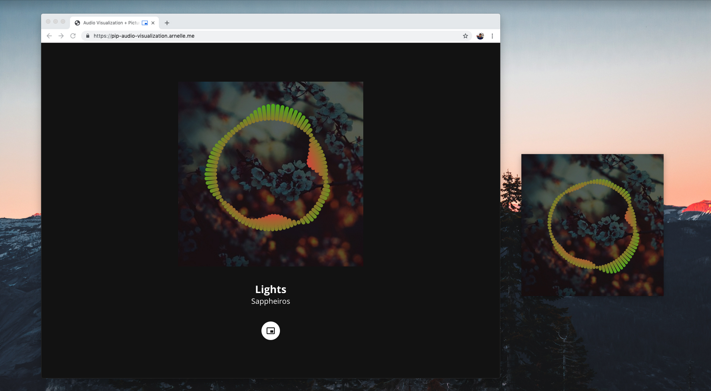

# Audio Visualization in Picture-in-Picture

A demo on displaying audio visualization inside a Picture-in-Picture window.

## How it's made

1. Use [Web Audio API][1] to read audio's waveform data
2. Use [Canvas API][2] to draw visualizations based on waveform data
3. Convert canvas into a video stream using `canvas.captureStream()`
4. Create a `<video>` element, using the canvas video stream as its source
5. `video.requestPictureInPicture()` to show the Picture-in-Picture window
6. Use [Media Session API][3] to add playback controls to the Picture-in-Picture window

[1]: https://developer.mozilla.org/en-US/docs/Web/API/Web_Audio_API
[2]: https://developer.mozilla.org/en-US/docs/Web/API/Canvas_API
[3]: https://developer.mozilla.org/en-US/docs/Web/API/Media_Session_API
